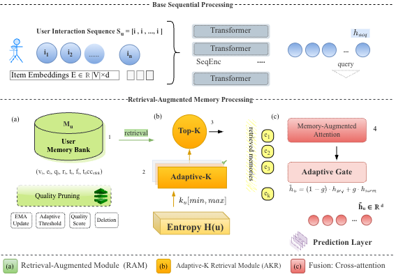
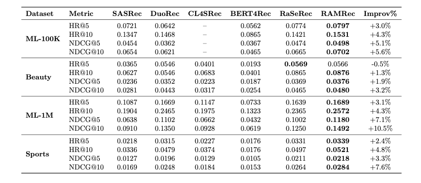

# IMPROVING SEQUENTIAL RECOMMENDATION WITH RETRIEVAL-AUGMENTED USER REPRESENTATION  ||  基于检索增强用户表示的序列推荐研究

### RAMRec
Official implementation of **"Dynamic Memory-Augmented Sequential Recommendation with Adaptive Retrieval"**.

[](https://github.com/HITszTMG/RAMRec)
[](https://www.python.org/)
[](LICENSE)

---

# Overview

Sequential recommendation systems face a **parametric memory bottleneck** where all user knowledge is confined within fixed model parameters. This leads to catastrophic forgetting and inability to leverage historical patterns.

**RAMRec** introduces two key innovations:
- **RAM (Retrieval-Augmented Memory Management)**: Dynamic user-specific memory banks with quality-based pruning
- **AKR (Adaptive-K Retrieval)**: Entropy-driven personalized retrieval depth based on user behavioral diversity

---

# Framework

We propose a new memory-augmented paradigm for sequential recommendation that maintains external episodic memories and adaptively retrieves them based on user characteristics.



**Key Components:**
1. **Transformer Encoder**: Processes sequential interactions
2. **Memory Banks**: Stores user-specific historical patterns
3. **Adaptive Retrieval**: Dynamically adjusts K based on entropy
4. **Cross-Attention Fusion**: Integrates memories with sequential representation

---

## Main Results

### Comparison with Baselines




## Quick Start

### Installation

```bash
# Clone repository
git clone https://github.com/HITszTMG/RAMRec.git
cd RAMRec

# Install dependencies
pip install -r requirements.txt
pip install recbole==1.1.1
```

### Datasets

Download datasets from [RecSysDatasets](https://github.com/RUCAIBox/RecSysDatasets) or their [Google Drive](https://drive.google.com/drive/folders/1ahiLmzU7cGRPXf5qGMqtAChte2eYp9gI).

Put the files in `./dataset/` like:
```
RAMRec/
├── dataset/
│   ├── ml-100k/
│   │   ├── ml-100k.inter
│   │   └── ml-100k.item
│   ├── Amazon_Beauty/
│   │   ├── Amazon_Beauty.inter
│   │   └── Amazon_Beauty.item
│   └── ...
```

### Training

```bash
# Run 
bash ramrec.sh

# Or run directly
python run_recbole.py --model=RAMRec --dataset=ml-100k --config_files=seq.yaml
```


<!-- # Citation

If you find this work useful, please cite:

```bibtex
@inproceedings{ramrec2025,
  title={RAMRec: Dynamic Memory-Augmented Sequential Recommendation with Adaptive Retrieval},
  author={Abdulyemmah, Zaid Qassim and Zhao, Xinping and Hu, Baotian},
  booktitle={Proceedings of the 19th ACM Conference on Recommender Systems},
  year={2025},
  address={Ljubljana, Slovenia}
}
```

--- -->

# Acknowledgments

This repo is based on:
- [RecBole](https://github.com/RUCAIBox/RecBole) - Unified recommendation framework
- [DuoRec](https://github.com/RuihongQiu/DuoRec) - Contrastive learning baseline

---

# 📄 License

This project is licensed under the MIT License.

---

<div align="center">

**⭐ If you find this repo useful, please star it! ⭐**

</div>
